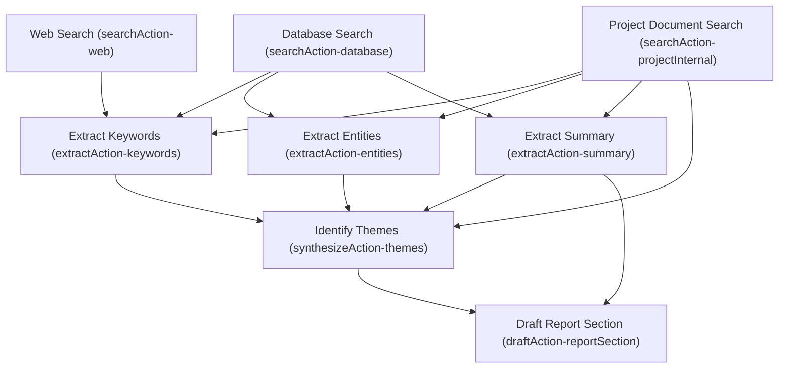

# Wonky
Human centric public policy research platform supported by generative ai and agents.

***Wonky's golden rule:*** If a person would not create an agent's output in their workflow, it should not be in a workflow.

## What is Wonky?
Wonky is an app that is aimed at people who need to understand the impacts of new policy, or researching new avenues for policy development.
The goal is to build a platform for government officials, public policy researchers, and those who are just curious in exploring the world of policy research.

The initial sources for this are CRS Reports and Wikipedia. CRS Reports are of very high quality analysis and providing 
lots of contextual information. Wikipedia is useful for further exploration or filling in gaps, but hardly an authoritative source.
Combining the two, and maintaining clear distinctions between the sources (and any additional sources), can provide both 
intuitive trust in the system by clearly defining the sources of information.

https://www.everycrsreport.com/

## What are Yargs?
There are so many gen ai products aimed at chatting with documents and creating personal RAGs off of your 
existing documents that it might seem that we don't need Yet-Another-RAG (Yargs) or Chat-With-My-Documents (ChWIMDs?).

Most Yargs are single turn chat systems. You upload your documents, ask questions about them, and quickly they run into the same problems.
While this is absolutely essential to research systems, it remains constrained to ad-hoc interactions.
Worse, reuse of great chats is next to impossible unless you reload the entire chat.

When working with token counts *and* worrying about maintaining accuracy, these systems just don't cut it.
Newer approaches by Anthropic, Google, and others, introduced the idea of Artifacts. This introduction of break points in
a interrogative workflow is often underrated as a new development when news is dominated by SOTA developments.

Furthermore, the advent of providing citations improves a fundamental process that improves trust in the system. It allows
the user to check the information, or follow up in new pathways.

## The Wonky Way
Wonky's meant to approach research like a library. You have a broad research goal, followed by multiple research streams.
Those research streams are meant to be targeted flows, but not independent like chat. Instead, those combine and grow your knowledge base.

Wonky recognizes this, along with the need to have AI systems as background first, actions second, and chat as ad-hoc.
Prompts for the system must be customizeable and contain its own (shareable) library that allows a user and teams to use what works and have a cleaner chat interaction.

Yes, this is inspired by NotebookLM, a fantastic platform. But I'm taking it a step further in not just UI/UX designs, the core of the workflows is part of the innovation.
This is meant to represent an interface for academic development of MLR-Heuristic design patterns for deep research as opposed to "reasoning" approaches.
The MLR-Heuristic is made of mental-heuristics, legal-heuristics, and rule-heuristics. The composition of these, along with structured documents, aims to improve the
reliability, trustworthiness, automated hallucination checks, and the ability to discover knowledge gaps as native capabilities.

### The Wonky Welcome
Wonky will greet you with the projects page. Research Workspaces contain multiple research streams. These streams represent different patterns of retrieving information,
analyzing and extracting information, and represent objectives that a user will engage in to research.

Further down, we can see the existing workspaces that we can select and open.

### The Research Stream
When creating a new workspace, you add at least one research stream. A stream is a way of going down a path where you have an objective that can be specified, 
but you want AI to get you started and cast a wide net on relevant articles and information.

There are different categories of research streams, with the option of users adding more by creating them in the Stream Builder.

A workspace can have multiple streams, and you can add them later on.

### The Research Workspace
The Research Workspace is where you start inspecting, exploring, and analyzing your data.

**Actions** Allow a user to either pick a pre-defined action for a specific follow up on the selected documents, or use one that the user built themself.

**Subjects** Ever forget where something is? Subjects will help you out with that.

**Timeline** Time is important! Who, what, where, and *when* should be at your fingertips

**Document Relationship Graph** As you perform more actions and derive new information, those relationships are important for keeping track of what it is that you've done,
and where your information is based.

**Guided Chat** 
* **Personas** give you a way to break free of the blank page problem. Use a persona to interrogate your documents, or find new ones that you need to add.
* **Tangents** are there to let you get outside of a rut. Hop on a tangent, think of something new, there you might find links between ideas you didn't find before

**Notes** No personal knowledge management or research platform should be without notes.

### Prompt Composition
Wonky approaches prompts differently. While the demo prompts are common, the core heuristic pattern is meant to be strict rules or clear evaluation frameworks that correspond to rule heuristics and legal heuristics. Together, these act as modules of extractions to defined templates and fields, or synthesize knowledge from those extractions. As the platform is built out, more capabilities and Wonky Prompts will be integrated.

**Prompt Components** and general use prompts for the main chat have different categories to organize the scope of different prompts and provide guidance on what to use when.

### Reviewable Research Stream builder
Not all sequences and agents are of the same quality. While standardized templated documents help significantly in allowing users to create their own workflows,
that does not mean that it is necessarily desireable.

Research Stream Builder allows a user to mock up what they want and then export it as a mermaid diagram. That diagram can then be provided
to a data scientist or data analyst to review, interview the user, and parameterize so that the workflow is meeting specifications.
Future work can easily translate the mermaid diagram to a workflow, but this capability should be separable based on the user.

Mermaid diagrams are used because of their universality and because they represent the core behind Wonky: Burr. With existing streams, and existing prompt sets
for complex analysis, these are exportable as nodes (which can be sequences of events as well) that can be parameterized. Ensuring the final flow lines up with the code 
becomes much easier in comparing a mermaid diagram from Wonky to the one that was algorithmically built with Burr.

An example of the mermaid output:

## What Wonky focuses on:
#### Wonky approaches the use of LLMs from the perspective that users need clear, intuitive, and repeatable processes in their workflow. Researchers especially need citations, long chain information tracking, and non-prose documents that represent the information they need.
With the current citation and artifact approach, you are still bound to the LLM interpreting your chats correctly to initiate the creation of a document.
They also do not allow for customization of what a citation represents in a document, or for clear processes to be developed
for automated fact checking, reviewing, and other common human processes during research.

##### For a deep research system to work:
 - A platform must preserve documents across multiple sessions
 - These documents must be composable into new documents
 - Processes need to be repeatable and intuitive
 - Intermediate documents must be created within complex workflows for both: 
   - Human reviewable checks on the workflow's process
   - Providing branching points for researchers to start from for new research without rerunning an entire workflow
- Tasks that agents perform should represent the translation of knowledge and information from one source to another, not a cognitive process or "thinking" done by an LLM since these cannot be verified as being related at all to the final output.
- Citations cannot be arbitrary
  - Citations that are arbitrary sections can be helpful for tracing the source of information, but releasing the control of citations means being locked into chunking strategies within an index, the whim of an llm, and a single universal structure for all information (this is just patently false). 

### To do this we must think of workflows and documents as structured documents, not prose
Key to this concept is that a workflow does not necessarily terminate in the final document.
When drafting an executive summary, multiple sources are used to compose the final draft.
In most agentic systems, like Langchain, LangGraph, and many more, these documents are either:
- Hidden from the user after completion
- May not represent anything resembling what a person might provide
- Inconsistent between different runs

Designing agentic systems should focus on these documents first.
Because they represent a collection of information from multiple documents, these **must** represent something that a person might develop.
If a user cannot easily review the supporting documents, they waste time that could be spent on ideation or deeper manual research.

##### How can we do this? Structuring intermediate documents.
If these documents do not follow any sort of structured approach with definable fields and what goes into those fields and/or excluded (just prose), 
the output of the system is much more likely to vary. Prose centric information is difficult to define with rules and llms often have their own voice in writing this.
Structuring intermediate documents means providing definable fields **that only relate to the information within the document**.
These fields are far more easily defined by rules around what information is valuable and structuring them as lists provides
the user with a much faster fact checking process. They can also use parts of the document for future work,
or if one of the sections is incorrect, the rest might be of high value and still usable.

This is called a fast-rejection time.

This fast rejection time is central to most information retrieval systems with a focus on relevance at a top-n.
A person can quickly scan the first 3 or 5 results from a search and before even being able to fully read the snippets and titles,
they're able to roughly determine relevance. If no relevant documents are there, the turnaround to a new query is fast.

Prose based systems do not have this quality because they have a high level of uniqueness per document.

This also prevents the accumulation of skill in using a tool.

Even if a structured document's fields do not always perfectly align with what a user might want, they can leverage the format
to develop scanning skills to identify what information they truly need, or is missing from the final document.
Building skill with a tool is difficult with the high variance of llm outputs and constant drift in prompt engineering.
If you can't use yesterday's methods today, then you are always being reset to zero.

Agent based systems suffer from that yesterday is not today problem.
- Each update to a model will shift its output.
- Each modification to an orchestrator will have significant downstream impacts.
- Processes that worked for one orchestration system might never work again or be permanently degraded in quality.

### Wonky is focused on agents that align with human-centric processes
There's so much more to Wonky than just structuring documents and creating intermediate documents.
However, every part of a workflow is driven by Wonky's golden rule. This means that there are multiple intermediate documents
of direct use to the user, even if the final output is incorrect or of limited use. Often, in 
research flows, the value of the research is in the notes as much as the report. In fact, in almost all workflows people 
undertake, we naturally learn to do them by first writing out the information we need and then compiling it 
into the final document. As we get better, we no longer need to take as many notes, or we get better at note taking.
But a workflow can, and should, be represented in this way.

Agentic systems that try to model a person's cognitive processes will always suffer from the fact that LLMs do not reason 
and cannot replicate what a person's internal process is. Worse yet, everyone has a different process.

Agentic systems that focus on the intermediate documents as human-centric and being of intermediate value helps solve this.
All that is needed is to map the structure of information in a source to a structure in the output.
This is still difficult, relies on domain knowledge, and can take a significant amount of time. However, 
it is much easier to deconstruct a workflow into these intermediate documents, get SME feedback on an alignment to what they expect to see, 
and follows the other principle of: ***LLMs need sufficient context to work well***

### Note:
This is a work in progress and recently underwent some major theoretical changes that will make future progress easier and more iterative. There have been revisions to the UI as well as refining the theory of MLR-Heuristics since this started, complete with the
intersection of taxonomies, ontologies, and knowledge graphs. Work will develop as it goes on and the rag will be modified soon and shifted to the heuristic patterns.
- [x] Update RAG to the structured document
- [x] Add code for obtaining EveryCRSReport
- [ ] Add table build scripts and dummy data
- [ ] Add ingestion code for CRS reports
- [ ] Standardize Burr Flows
- [ ] Add Actions
- [ ] Add Competency Questions
- [x] Standardize RAG structures
- [ ] Add additional flows
- [x] Add research actions
- [ ] Add chat system
- [ ] Add search documents and add functionality
- [ ] Build prompt library
- [ ] Solr Search adaptors
- [ ] Elastic Search adaptors